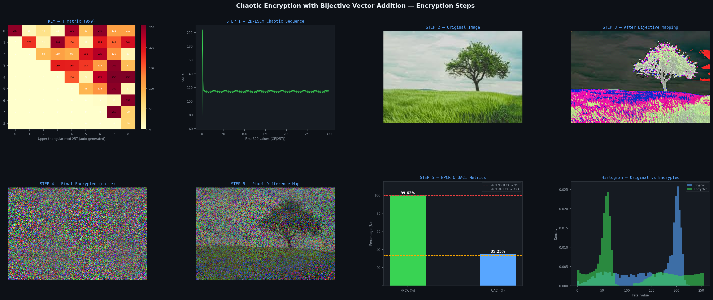
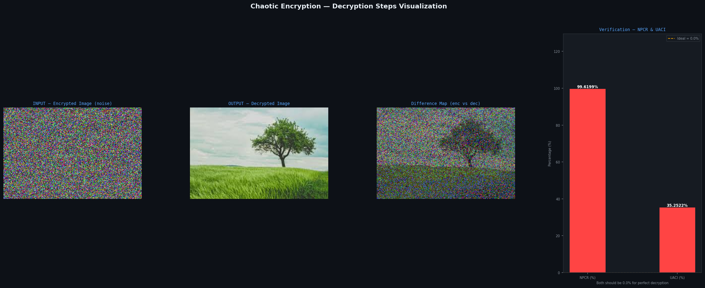

# 🔒 Secure Image Encryption Web

Secure Image Encryption Web is a Flask-based web application developed to demonstrate secure image encryption and decryption using compressed sensing techniques. The application provides an intuitive web interface that allows users to upload images, perform encryption and decryption operations, and visualize the corresponding outputs. The project is intended for educational, research, and demonstration purposes in the field of secure image communication.

---

## 📖 Project Overview

This project implements a web-based workflow for secure image encryption and decryption. Users can upload an input image, execute the encryption process, and subsequently recover the original image through decryption. The system integrates image processing techniques with a Flask backend to provide a simple, efficient, and user-friendly interface.

---

## ✨ Key Features

- Secure image encryption and decryption
- Interactive web application developed using Flask
- Image upload and processing functionality
- Visualization of encryption and decryption outputs
- Support for common image formats
- Modular and maintainable Python implementation

---

## 🛠️ Technologies Used

- Python
- Flask
- NumPy
- Pillow (PIL)
- HTML5
- CSS3

---

## 📂 Repository Structure

```text
Secure-Image-Encryption-Web/
│
├── src/
│   ├── app.py
│   ├── sender.py
│   └── receiver.py
│
├── templates/
│   └── index.html
│
├── static/
├── sample_data/
├── results/
├── docs/
├── uploads/
├── outputs/
│
├── requirements.txt
├── README.md
├── LICENSE
└── .gitignore
```

---

## ⚙️ Installation

### Clone the repository

```bash
git clone https://github.com/Mitra-T-S/Secure-Image-Encryption-Web.git
```

### Navigate to the project directory

```bash
cd Secure-Image-Encryption-Web
```

### Install the required dependencies

```bash
pip install -r requirements.txt
```

---

## ▶️ Running the Application

Run the Flask application using:

```bash
python src/app.py
```

Once the server starts, open your browser and navigate to:

```text
http://127.0.0.1:5000
```

---

## 🚀 Usage

1. Launch the Flask application.
2. Upload an input image.
3. Perform image encryption.
4. View the encrypted output.
5. Perform image decryption.
6. Compare the decrypted image with the original image.

---
## 📊 Results

Representative outputs generated by the application are available in the `results/` directory.

### Encryption Visualization



---

### Encrypted Image


---

### Decryption Visualization



---

### Decrypted Image


## 📁 Sample Data

Example input images for testing are provided in the **sample_data/** directory.

---

## 🔮 Future Enhancements

- Integration of advanced chaotic encryption algorithms
- Support for batch image encryption
- Performance optimization
- Enhanced visualization and analysis
- User authentication
- Cloud deployment

---

## 🤝 Contributing

Contributions are welcome. If you would like to improve this project, please fork the repository, create a feature branch, and submit a pull request.

---

## 📄 License

This project is licensed under the **MIT License**.

---

## 👨‍💻 Author

**Mitra T S**

GitHub: https://github.com/Mitra-T-S
